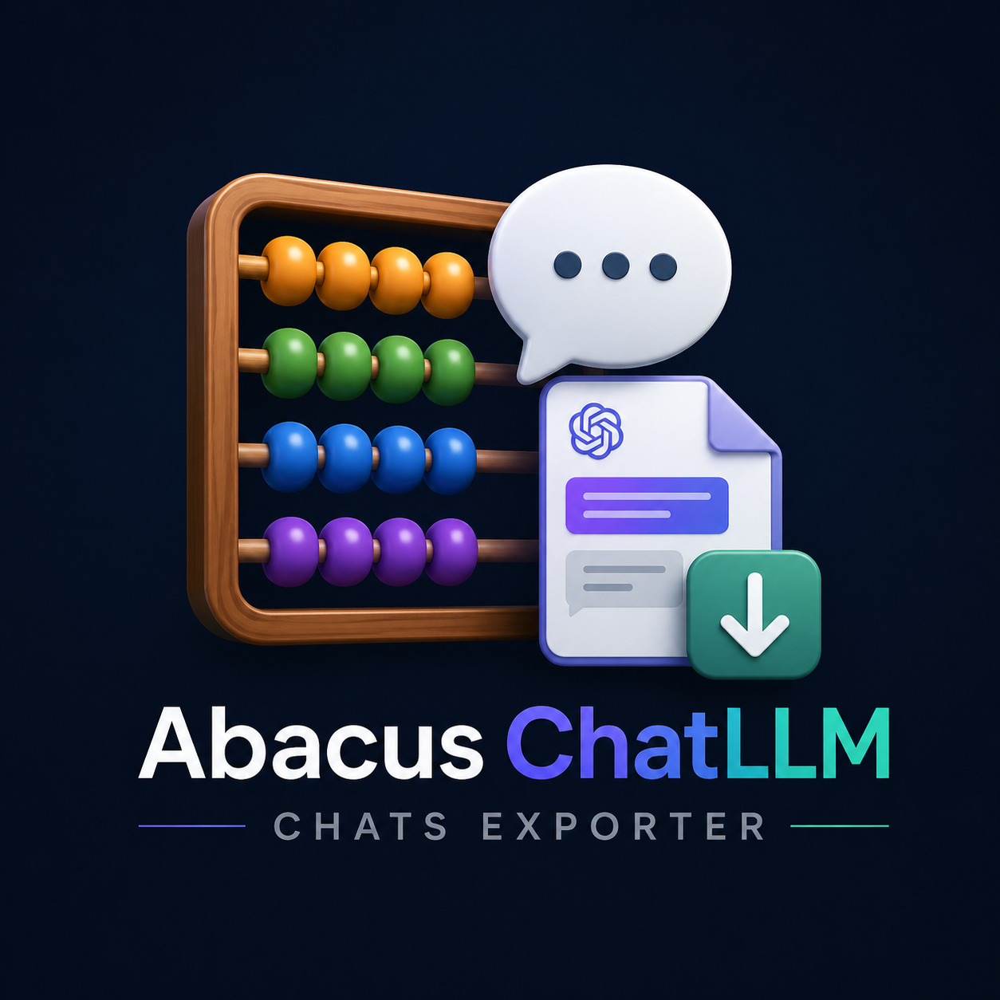

# Abacus ChatLLM Exporter

This repository publishes the flow that actually worked in practice: a lightweight REST exporter plus a local viewer.

The supported path is `v1/`. It calls Abacus ChatLLM REST endpoints directly using your local browser cookies and, optionally, a local storage dump for `deploymentId` and `appId`.

HAR files are not required to use this repo. They were useful during reverse engineering, but the exporter itself does not replay HAR traffic.



## Repository layout

- `v1/`
  Supported exporter and viewer.
- `resources/`
  Local-only inputs such as `cookies.txt`, `cookies.json`, and `localStorage_dump.json`. This directory is ignored by git.
- `legacy/console-offline/`
  Earlier experimental scripts kept for reference only. They are not the recommended path.

## Supported flow

1. Sign in to Abacus ChatLLM in your browser.
2. Collect local session inputs in `resources/`.
   Expected files:
   - `resources/cookies.txt` or `resources/cookies.json`
   - optional `resources/localStorage_dump.json`
3. If you do not have `localStorage_dump.json`, open DevTools, perform a few actions in ChatLLM, export the Network log as a HAR file, and use it to find the IDs you need:
   - `appId`
     Look for a ChatLLM page URL such as `https://apps.abacus.ai/chatllm/?appId=...`
   - `deploymentId`
     Look for requests such as `listDeploymentConversations?deploymentId=...` or `getDeploymentConversation?deploymentId=...`
4. Run the regular chat exporter:

```bash
node v1/export_chatllm.js --limit 4 --deployment-id <deploymentId> --app-id <appId>
```

5. Run the project chat exporter if needed:

```bash
node v1/export_chatllm_projects.js --limit 4 --deployment-id <deploymentId> --app-id <appId>
```

6. Start the viewer:

```bash
python3 -m http.server 8788 --directory v1
```

7. Open `http://localhost:8788/viewer/`

The viewer auto-loads:

- `v1/out/abacus-chats.json`
- `v1/out/abacus-project-chats.json`

## Notes on IDs and HAR files

If `resources/localStorage_dump.json` is present, the exporters auto-read:

- `regularDeploymentItem` as `deploymentId`
- `regularDeploymentAppId` as `appId`

If you do not have that file, pass `--deployment-id` and `--app-id` directly from your HAR or DevTools network capture.

## Publish safely

Do not commit:

- cookies
- local/session storage dumps
- HAR files
- exported chats
- screenshots with visible chat titles, project names, user details, or account metadata

The repo ignores the common sensitive files, but review `git status` before pushing.

## Version notes

`v1/` is the maintained version.

The files under `legacy/console-offline/` reflect earlier experiments around console scraping and offline post-processing. They remain in the repo only as reference material and should not be treated as the canonical flow.
